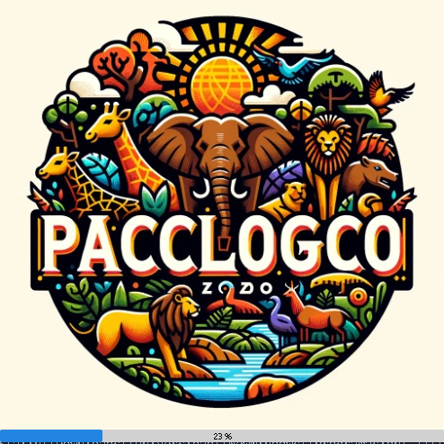
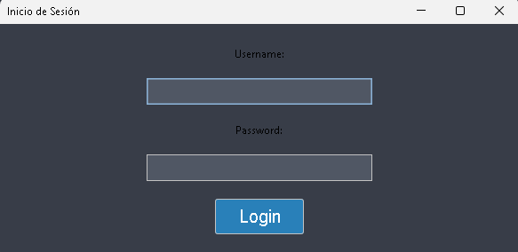

## PACCLOGICO

Protección de Animales con Cuidados Cordinados
Es una aplicación para ordenadores desarrollada en Java para la gestión de información de animales de un zoológico. Permite registrar animales con información como hábitat, clasificación, foto, código QR, etc. Cuenta con interfaz gráfica de usuario para las operaciones CRUD.

### Estructura del Proyecto

La estructura del proyecto esta dada de la siguiente manera:

- **Main**: Punto de entrada del programa.
- **DAC (Data Access Component)**: Contiene las clases y métodos para interactuar con la base de datos.
- **Paquete DAC** 
    - Clases DAO para acceso a datos (una por cada entidad)
**Paquete DTO**
    - Clases DTO para transferencia de datos
- **BL (Business Logic)**: Contiene la lógica del negocio.
- **Interfaces**: Contiene las interfaces de usuario.
**ScriptsDB**
    - Scripts SQL para creación de BD
**Recursos**
    - Imágenes

### Requisitos

- Java JDK 21.0.2 o superior.

### Instalación

Pasos para instalar y configurar el proyecto:

1. Clona este repositorio: `git clone https://github.com/stalinab/Pacclogico.git`
2. Abre el proyecto en tu IDE favorito(Visual Studio Code de preferencia).
3. Ejecutar los scripts SQL en /Script para crear el esquema de BD.
4. Ejecuta el archivo `App.java`.

### Uso

Pasos Para Usar el sistema:

1. Abre la aplicación.
2. Ingresa tus credenciales en el formulario de inicio de sesión.
3. Explora las diferentes funcionalidades de la aplicación.

### Estructura de la Base de Datos

- **DDL (Data Definition Language)**: Scripts para la creación de tablas.
- **DML (Data Manipulation Language)**: Scripts para la inserción, actualización y eliminación de datos.

### Componentes

#### DAC (Data Access Component)

Su propósito es abstraer y encapsular el acceso a los datos de la tabla Animal en la base de datos.

AnimalDAO:
* Este componente DataAccessComponent.AnimalDAO implementa el patrón de acceso a datos DAO (Data Access Object) para la entidad Animal.
* Extiende de SQLiteDataHelper, que provee funciones genéricas para conectarse a la DB SQLite y manejar conexiones.
* Implementa la interfaz IDAO que define los métodos CRUD (Create, Read, Update, Delete) estándar para un DAO.
* Los métodos como read(), readAll(), create(), update(), delete() ejecutan consultas SQL parametrizadas hacia la base de datos para realizar operaciones CRUD en la tabla Animal.
* Usa PreparedStatements para evitar inyección SQL.
* Maneja y lanza excepciones adecudos.
* Algunos métodos como readUs(), readUsAll() son específicos para consultas personalizadas.
* Utiliza Objects Data Transfer (DTO) como AnimalDTO para transferir datos desde la base de datos.

En conclusión, proporciona una interfaz simple mediante métodos CRUD para que otros componentes como la lógica de negocio puedan utilizar para acceder y persistir datos de Animal, sin tener que lidiar directamente con la complejidad de SQL, JDBC, conexiones, etc.

#### BL (Business Logic)

En este apartado la lógica de negocio se enfoca en exponer las operaciones de la entidad correspondiente, utilizando el patrón DAO para abstraer el acceso a datos.

La lógica de negocio en estos componentes consiste principalmente en llamar a los métodos del DAO (Data Access Object) correspondiente para acceder a los datos y encapsular esa lógica.

AnimalBL:
Utiliza AnimalDAO para interactuar con los datos de AnimalDTO.

Los métodos exponen funcionalidades como:
getAll(): Obtiene todos los animales
getBy(): Obtiene un animal por ID
add(): Agrega un nuevo animal
update(): Actualiza un animal
delete(): Elimina un animal
getMaxId(): Obtiene el máximo ID
Es decir, AnimalBL se enfoca en la lógica de negocio de los animales, delegando el acceso a datos a AnimalDAO.

#### Interfaces

Al ejecutar la App observamos un Splash Screen que carga información antes del login. De esta manera:

Además, observamos un login que permite acceder al sistema mediante una autenticación.

### Contribución

Instrucciones para contribuir al proyecto, por ejemplo:

1. Haz un fork del repositorio.
2. Crea una rama con una nueva característica: `git checkout -b nueva-caracteristica`
3. Realiza tus cambios y haz commit: `git commit -am 'Añade nueva característica'`
4. Sube los cambios a tu repositorio: `git push origin nueva-caracteristica`
5. Crea un pull request en GitHub.

### Contacto

- Email: stalin.anrango@epn.edu.ec
